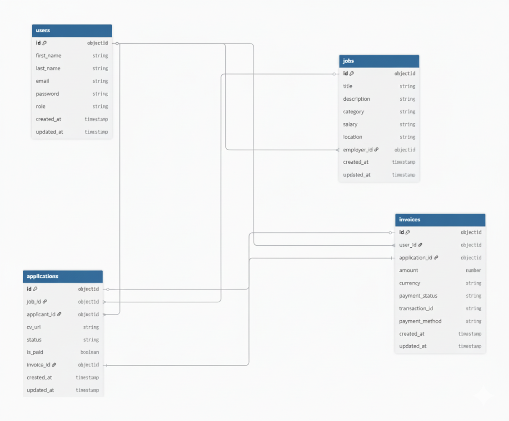

# HireMe - Job Portal API

HireMe is a comprehensive job portal backend built with **Node.js**, **Express**, and **MongoDB**. It provides a secure, role-based platform for Admins, Employers, and Job Seekers, featuring an integrated **Stripe** payment flow for job applications.

### Project Resources
* **Postman Documentation:** [Live API Docs](https://documenter.getpostman.com/view/32169346/2sBXVfiB19)
* **ERD Diagram:** Available in the `docs/ERD.png` file within this repository.

---

## Tech Stack
* **Backend:** Node.js & Express.js
* **Database:** MongoDB (Mongoose ODM)
* **Payment Gateway:** Stripe API
* **Authentication:** JWT (JsonWebToken) & Bcrypt
* **Validation:** Joi

---

## Setup & Installation

1. **Clone the Repository**
   ```bash
   https://github.com/monir-hossaien/hire_me_backend.git

### Install Dependencies

```bash
npm install
````


## Environment Configuration

Create a `.env` file in the root directory and add the following variables:

```env
PORT=5000
MONGO_URI=your_mongodb_connection_string
JWT_SECRET=your_jwt_secret_key
STRIPE_SECRET_KEY=your_stripe_secret_key
FRONTEND_URL= your domain url
```

## Run the Application

```bash
# Development mode
npm run dev

# Production mode
npm start
```


## API Endpoints

### Authentication (/api/v1/)

| Method | Endpoint | Access | Description |
| :--- | :--- | :--- | :--- |
| POST | /register | Public | Create a new account |
| POST | /login | Public | Login and get JWT token |
| GET | /logout | Public | Clear session cookies |

---

### Job Management (/api/v1/)

| Method | Endpoint | Access | Description |
| :--- | :--- | :--- | :--- |
| POST | /create-job | Admin, Employer | Post a new job |
| GET | /all-jobs | All | Fetch all available jobs |
| GET | /search-jobs/:category | All | Search by category |
| GET | /fetch-job-details/:job_id | All | View job details |
| PUT | /update-job/:job_id | Admin, Employer | Update job info |
| DELETE | /delete-job/:job_id | Admin, Employer | Remove a job post |

---

### Applications & Payments (`/api/v1/`)

| Method | Endpoint | Access | Description |
| :--- | :--- | :--- | :--- |
| POST | /create-checkout-session/:job_id | Job Seeker | Upload CV & Pay Fee |
| GET | /verify-payment | Job Seeker | Verify Stripe & Apply |
| GET | /all-applications | All (Auth) | View applications |
| PATCH | /update-status/:application_id | Admin, Employer | Accept/Reject |

### Admin Management (`/api/v1/`)

| Method | Endpoint | Access | Description |
| :--- | :--- | :--- | :--- |
| GET | /users | Admin | List all users |
| PATCH | /update-user/:user_id | Admin | Edit user roles |
| DELETE | /delete-user/:user_id | Admin | Cascade delete user |
| GET | /analytics | Admin | View platform stats |

---
## Database Schema (ERD)
The system architecture consists of 4 primary entities: **Users**, **Jobs**, **Applications**, and **Invoices**. Relationships are handled via Mongoose ObjectIds to ensure data integrity.




## Payment & Application Flow
1. **Initiate:** Job Seeker calls `create-checkout-session` and uploads their CV.
2. **Checkout:** The server interacts with Stripe to generate a unique secure payment URL.
3. **Verification:** Upon successful payment, the user is redirected to the `verify-payment` endpoint.
4. **Completion:** The system validates the session, creates an **Invoice**, and saves the **Application** record with `is_paid: true`.


